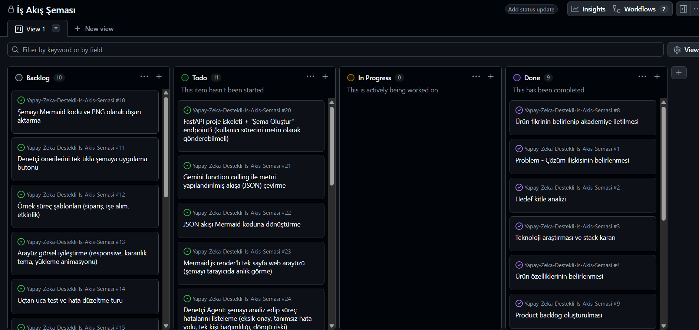
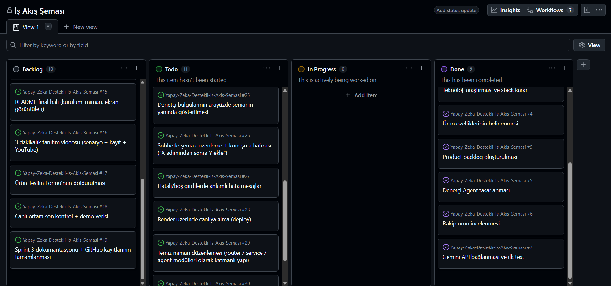

# Takım İsmi

Takım 22

# Ürün İle İlgili Bilgiler

## Takım Elemanları

| İsim | Rol |
|---|---|
| İbrahim Salih Aslan | Scrum Master |
| Yiğit Taha Ak | Product Owner |
| Kübra Altuntaş | Developer |

## Ürün İsmi

**Yapay Zeka Destekli İş Akış Şeması**

## Ürün Açıklaması

Küçük işletmeler, öğrenci toplulukları ve ekipler süreçlerini bilir ama belgeleyemez; akış şeması araçları (Visio, draw.io vb.) hem teknik bilgi hem ciddi zaman ister. Ürünümüz bu sorunu tersine çevirir: kullanıcı sürecini **konuşma diliyle, dağınık şekilde bile anlatır**, sistem bunu otomatik olarak profesyonel bir iş akış şemasına dönüştürür.

Ürünü benzerlerinden ayıran temel özellik, yalnızca şema **çizmemesi**, süreci **teşhis etmesidir**. Entegre Denetçi Agent, oluşturulan akışı analiz ederek eksik onay adımlarını, hata durumunda tanımsız kalan yolları, tek kişiye bağımlı kritik adımları ve döngü risklerini tespit edip şema üzerinde işaretler ve iyileştirme önerileri sunar. Kullanıcı, şemayı sohbet arayüzü üzerinden doğal dille düzenleyebilir ("fatura adımından sonra müdür onayı ekle" gibi); sistem konuşma geçmişini hatırlayarak şemayı adım adım geliştirir.

## Ürün Özellikleri

- Doğal dilden (Türkçe) otomatik iş akış şeması üretimi (Gemini function calling ile yapılandırılmış çıkarım)
- Mermaid.js ile anlık, tarayıcıda render edilen şema görselleştirme
- **Denetçi Agent:** süreç hatalarını (eksik onay, tanımsız hata yolu, tek kişiye bağımlılık, döngü riski) tespit eden ikinci yapay zeka katmanı
- Sohbet tabanlı şema düzenleme, konuşma hafızası ile çok adımlı revizyon
- Şemayı Mermaid kodu / görsel olarak dışa aktarma
- Web üzerinden erişilebilir, kurulum gerektirmeyen arayüz

## Hedef Kitle

- Süreçlerini belgelemek isteyen ancak teknik şema aracı kullanmayan KOBİ'ler
- Operasyon / süreç sorumluluğu olan ekip yöneticileri
- Etkinlik ve işleyiş süreçlerini belgelemek isteyen öğrenci toplulukları
- Süreç analizi öğrenen öğrenciler ve yeni başlayan iş analistleri

## Product Backlog URL

---

# Sprint 1
- Sprint Board screenshotları:

# Sprint 2

# Sprint 3

